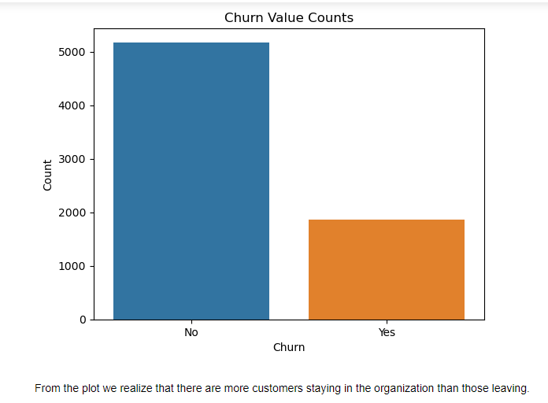
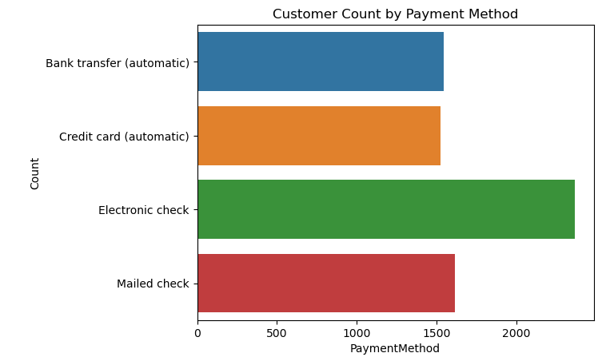
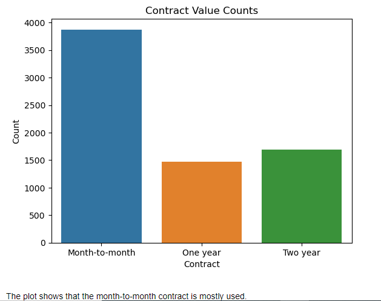
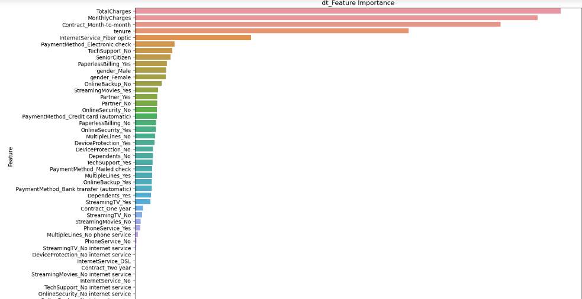
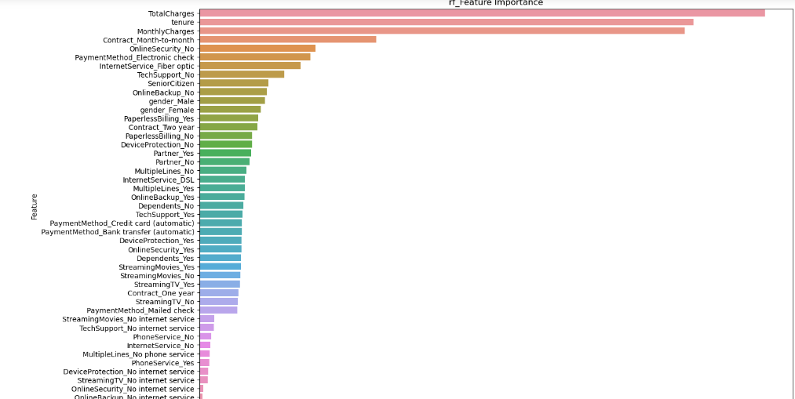
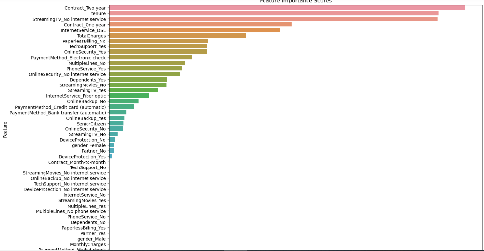
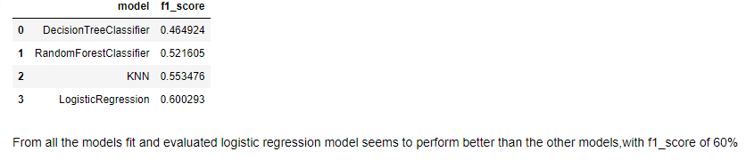

# Predicting-Customer-Churn--Machine-Learning 📊🔮

## Introduction 📝
Customer churn also known as customer turnover is the fraction of customers that stopped patronizing a company's products or services for a specific period.This is a customer churn prediction project that aims to predict customer churn using exploratory data analysis (EDA) and various machine learning models. The goal is to help businesses understand and anticipate customer churn, allowing them to take proactive measures to retain valuable customers.

## Data Description📊
The dataset used in this project can be found in the Datasets/ directory. It consists of customer information such as follows:

Gender -- Whether the customer is a male or a female\
SeniorCitizen -- Whether a customer is a senior citizen or not\
Partner -- Whether the customer has a partner or not (Yes, No)\
Dependents -- Whether the customer has dependents or not (Yes, No)\
Tenure -- Number of months the customer has stayed with the company\
Phone Service -- Whether the customer has a phone service or not (Yes, No)\
MultipleLines -- Whether the customer has multiple lines or not\
InternetService -- Customer's internet service provider (DSL, Fiber Optic, No)\
OnlineSecurity -- Whether the customer has online security or not (Yes, No, No Internet)\
OnlineBackup -- Whether the customer has online backup or not (Yes, No, No Internet)\
DeviceProtection -- Whether the customer has device protection or not (Yes, No, No internet service)\
TechSupport -- Whether the customer has tech support or not (Yes, No, No internet)\
StreamingTV -- Whether the customer has streaming TV or not (Yes, No, No internet service)\
StreamingMovies -- Whether the customer has streaming movies or not (Yes, No, No Internet service)\
Contract -- The contract term of the customer (Month-to-Month, One year, Two year)\
PaperlessBilling -- Whether the customer has paperless billing or not (Yes, No)\
Payment Method -- The customer's payment method (Electronic check, mailed check, Bank transfer(automatic), Credit card(automatic))\
MonthlyCharges -- The amount charged to the customer monthly\
TotalCharges -- The total amount charged to the customer\
Churn -- Whether the customer churned or not (Yes or No)
 

## Exploratory Data Analysis 📈
To understand the data and gain insights, we perform exploratory data analysis. The customer_churn.ipynb contains detailed analysis with visualizations and observations.
 
 
 
 
## Modeling 🔮
In the notebook, we build and train several machine learning models for customer churn prediction. We experiment with algorithms such as Decision tree, logistic regression, random forest, and KN-Neighbour.

 Decision tree model important features\
 

Random forest model important features\
 

Logistic regression model important features\
 
 
## Evaluation 📝
To evaluate the performance of our models, we use appropriate metrics, F1 score. The notebook  howcases the evaluation results.
The comparision of f1_score of the different models\

## Usage
Download or Clone the repository and navigate to the project directory. Clone this repository to your local machine using the following command:

https://github.com/Pendopr/Predicting-Customer-Churn--Machine-Learning

## Contribution 
Pull request are welcome

## Author
Penina Pendo\

